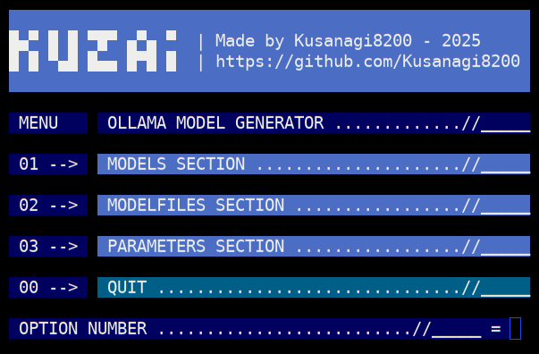

## **KUZAI AND KUZCHAT**

### **I hacked Major Kusanagi's ghost  -  LLM Research Repository**

**Dedicated to exploring and documenting research on large language models (LLMs)**. 
_____________________________________________________________________________________________

### **1 --> KuzAI - Bash App for Ollama Model Management**

KuzAI is a Bash script designed to simplify the management of models and Modelfiles for the Ollama framework. 
This tool provides an interactive, color-coded menu interface to perform various tasks such as listing, creating, running, modifying, models and Modelfiles.

It is distributed under the GNU General Public License (GPL) v3 or later, ensuring it is free and open-source software.

#### Features

KuzAI organizes its functionalities into three main sections: **Models**, **Modelfiles**, and **Parameters**.
Below is a detailed breakdown of what the application can do.
_____________________________________________________________________________________________

#### 1. Main Menu

**The entry point of the application is the KuzAI Menu, which offers the following options.**

    --> Models Section: Manage existing Ollama models.
    --> Modelfiles Section: Work with Modelfiles stored in the Kusanagi-Section/ directory.
    --> Parameters Section: View parameter files stored in the Parameters-Section/ directory.
    --> Quit: Exit the application.

#### 2. Models Section

**This section allows you to interact with models already installed in Ollama.** 

**Available options include**
    
    --> List a Model: Displays a list of all installed models using ollama list
    --> Delete a Model: Prompts for a model name and deletes it using ollama delete
    --> Run a Model: Prompts for a model name and runs it with ollama run

    --> Back to Main Menu
    --> Quit: Exits the application

#### 3. Modelfiles Section

**This section manages Modelfiles located in the Kusanagi-Section/ directory.
It requires this directory to exist; otherwise, the script will exit with an error.**

**The options are :**

**List Available Modelfiles**

    --> Lists all files in Kusanagi-Section/ with numbered options
    
**Create and Run a New Model** 
    
    --> Lists available Modelfiles
    --> Prompts for a Modelfile number to use
    --> Asks for a new model name and creates it with ollama create
    --> Prompts for a model name to run with ollama run
        
**Modify a Modelfile**
   
    --> Lists available Modelfiles
    --> Prompts for a Modelfile number to edit
    --> Creates a backup (prefixed with old_) of the selected Modelfile
    --> Opens the Modelfile in the nano editor for modification
        
**Delete a Modelfile**

    --> Lists available Modelfiles
    --> Prompts for a Modelfile number to delete
    --> Deletes the selected Modelfile from Kusanagi-Section/
        
    --> Back to Main Menu
    --> Quit: Exits the application

#### 4. Parameters Section

**This section is dedicated to viewing parameter files stored in the Parameters-Section/ directory.** 

**It includes :**

**List and View Parameters**

    --> Lists all files in Parameters-Section/
    --> Prompts for a file number to view (or 0 to go back)
    --> Displays the contents of the selected file using cat

    --> Back to Main Menu: Returns to the main menu
    --> Quit: Exits the application

### How It Works

**Execution Flow**

The script starts with the Main Menu
Users select an option by entering a number (e.g., 01 for Models Section)
Within each section, a submenu provides specific tasks
Tasks prompt for additional input (e.g., model names or file numbers) where necessary
After completing a task, the submenu reappears unless the user chooses to go back or quit

#### Ollama Set-Up

--> curl -fsSL https://ollama.com/install.sh | sh
The script assumes the ollama command-line tool is installed and configured

#### Local System

--> apt install git nano 
--> git clone https://github.com/Kusanagi8200/KuzAI.git

Kusanagi-Section/: A directory containing Modelfiles
Parameters-Section/: A Directory for storing parameter files (required for the Parameters Section).
nano is used as the default editor for modifying Modelfiles. (You can change it in automat-model.sh)
    
**In your modelfile, you have to select the model you want to use : FROM $MODEL:latest**

Make a alias in your .bashrc or in the /KuzAI directory launch ./automat-model.sh (chmod +x automat-model.sh maybe needed)

Specify your desired parameters in modelfiles. Create, modify and run models...

_____________________________________________________________________________________________

### **2 ---> KuzChat - Enjoy the discussion with local Chatbot Interface connected to your models**

<picture>
 <source media="(prefers-color-scheme: dark)" srcset="https://github.com/Kusanagi8200/Kusanagi8200/blob/main/KUZCHAT.jpg">
 <source media="(prefers-color-scheme: light)" srcset="https://github.com/Kusanagi8200/Kusanagi8200/blob/main/KUZCHAT.jpg">
 
</picture> 

**KuzChat is a simple web application that allows users to interact with an AI model through a chat interface.\ 
It connects to a local API to generate real-time responses using a custom model created with KuzAI.\ 
The project features a chat UI, message sending and stopping capabilities, and a sidebar with information.**

_____________________________________________________________________________________________

### **FEATURES**

    Chat Interface --> Send messages and receive responses in real-time streaming.
    
    Request Management --> Uses the Fetch API with an AbortController to cancel ongoing requests.
    
    Real-Time Display --> Responses from the model are displayed progressively as they are generated.
    
    Minimalist Design --> Clean interface with a sidebar for info and a footer with a GitHub link.

### **REQUIRED SOFTWARE**

    Apache2 --> Web server to host the application.
    Install on Debian: apt update && sudo apt install apache2
    Start the service: systemctl start apache2
    Check status: systemctl status apache2
        
    Ollama --> Framework to run AI models locally.
    See on the KuzAI part for installation.
    Run Ollama with: ollama serve $MODEL
    Ensure the API is accessible at http://$IP:11434 (adjust the IP based on your network setup).
   

### **DEPENDENCIES**

    No external frameworks or libraries are required. The project uses plain HTML, CSS, and vanilla JavaScript.

### **INSTALLATION**

    Clone the Repository:

    git clone https://github.com/Kusanagi8200/KuzAI.git
    cd KuzAI

### **SET UP APACHE2**

    Copy the project files to Apache’s default directory (e.g., /var/www/html)
    cp -r . /var/www/html/kuzai

### **ENSURE PROPER PERMISSIONS**

    chown -R www-data:www-data /var/www/html/kuzai

### **RUN OLLAMA WITH THE kUZAI MODEL**

    ollama run $MODEL

### **EDIT SCRIPT.JS TO SPECIFY AN AVAILABLE MODEL IN THIS LINE**

    body: JSON.stringify({ model: '$MODEL', prompt: prompt })

        
### **ACCESS THE APPLICATION**

    Open a browser and navigate to http://localhost/kuzai (replace localhost with your server’s IP if needed).

_____________________________________________________________________________________________

#### **PROJECT STRUCTURE**

**index.html -->** Contains the HTML structure (sidebar, chat, footer).\

**styles.css -->** Defines the app’s styling (not provided here; create it based on your preferences).\

**script.js -->** Handles the JavaScript logic, including sending messages and receiving streaming responses.\

#### **WORKFLOW**

**Sending a Message -->** The user types a message in the <input id="userInput"> field and clicks "SEND".\
The sendMessage() function is triggered, adding the message to the UI via addMessage(prompt,true) and sending\
a POST request to the API (http://192.168.124.187/api/generate).
    
**Streaming Response -->** The response is read continuously using response.body.getReader().\
Data is decoded and appended to a bot-message div in real-time.
    
**Stopping Generation -->** The "STOP" button calls stopGeneration(), which uses AbortController.abort() to cancel the ongoing request.
    
**Error Handling -->** If the request is aborted, "ABORTED - TRY AGAIN" is displayed.\ 
For network or other errors, "ERROR - TRY AGAIN" is shown.

#### **TECHNICAL DETAILS**

**API -->** The app communicates with a local API at http://192.168.124.187/api/generate.\
Ensure this matches your Ollama server’s address.\

**Response Format -->** The API returns JSON data line-by-line, with a response key containing the generated text.

#### **CUSTOMIZATION**

**Change the Model -->** Update the model property in script.js to use a different Ollama model.\

**Adjust API IP -->** Replace 192.168.124.187 with your server’s IP in script.js.

**Styling -->** Modify styles.css to customize the look and feel.

#### **LIMITATIONS**

The app relies on a local Ollama instance; it won’t work without it.\
Basic error handling on the client side (only simple messages).
    
_____________________________________________________________________________________________

